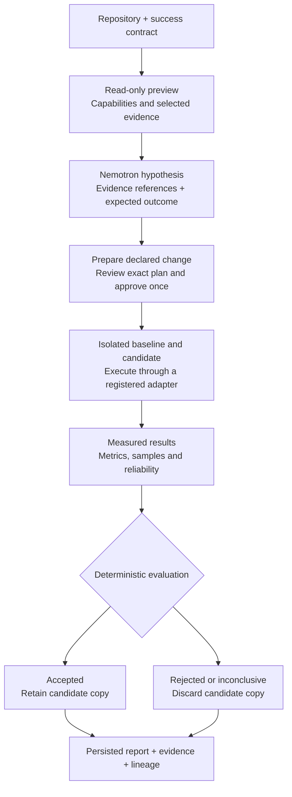
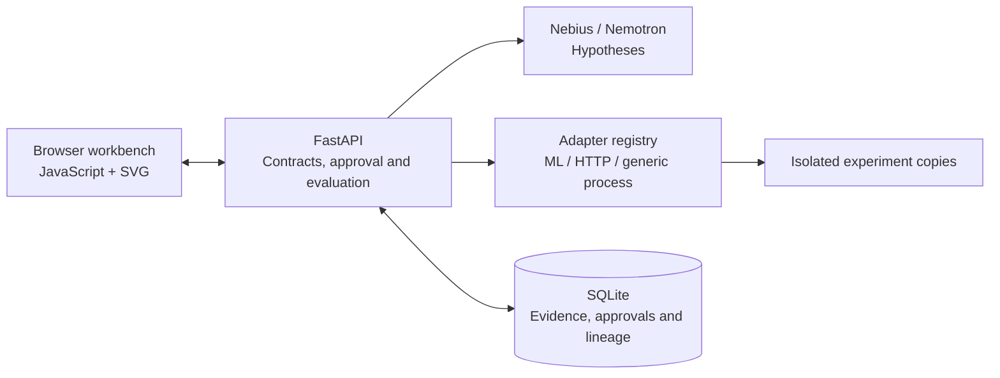

# ML Analyser

[](https://github.com/Nbit-51/ML_ANALYSER/actions/workflows/ci.yml)

### From an optimization hypothesis to a measured engineering decision.

ML Analyser helps developers answer a concrete question: **did this change improve the project while preserving correctness?** It combines NVIDIA Nemotron reasoning with approval-gated experiments, baseline/candidate measurements and an inspectable evidence trail. ML is the flagship use case; the same engine also supports HTTP services and declared CLI, build, test-suite and microbenchmark harnesses.

Set a goal such as **lower validation RMSE** or **reduce P95 latency without changing the response**. Review the proposed explanation and declared configuration change, approve the experiment, then see what the measurements support: **accepted, rejected or inconclusive**.

**Nemotron reasons. Adapters measure. Deterministic rules decide.**

## The model and its role

Our live reasoning configuration uses **NVIDIA Nemotron 3 Super 120B-A12B**, served through **Nebius Token Factory** as `nvidia/nemotron-3-super-120b-a12b`.

It is a **reasoning large language model (LLM)** with a hybrid **Mamba–Transformer, mixture-of-experts (MoE)** architecture: roughly **120 billion total parameters, with 12 billion active per token**. MoE activates a subset of the model's experts for each token. See [NVIDIA's model description](https://research.nvidia.com/labs/nemotron/Nemotron-3-Super/) and [Nebius's integration example](https://github.com/nebius/token-factory-cookbook/blob/main/models/nemotron/nemotron3-super-120B.md).

In this project, Nemotron reads bounded repository excerpts and the success contract, then returns structured, falsifiable hypotheses citing evidence IDs. We use the hosted model through its API; we do not train or fine-tune it. The model cannot execute commands, invent benchmark measurements or override the evaluator. A deterministic **mock provider** keeps demos and CI reproducible without credentials.

## How an experiment works



**Example: the HTTP fixture.** The contract asks for P95 latency at or below **40 ms**, an improvement of at least **10 ms**, **zero errors** and an **unchanged response hash**. The declared candidate reduces an artificial response delay. The adapter runs warm-ups and repeated request batches; the workbench displays latency distributions, guardrail results and reliability. These are demonstration targets, not promised benchmark results. A faster response alone is insufficient if correctness or reliability fails.

## What the reviewer can inspect

- **Repository understanding:** source-byte language composition, detected capabilities and explicit execution readiness.
- **Measurement quality:** baseline/candidate charts, absolute and percentage deltas, raw-sample distributions and variability.
- **Decision traceability:** objective and guardrail status, selectable experiment lineage, evidence records and persisted reports.
- **Controlled changes:** manifest-declared JSON configuration edits, fingerprint-bound approval and separate workspaces. The original repository stays unchanged.



## Run locally

Use Python 3.11+ and Node.js for frontend tests.

```sh
python -m venv .venv
```

Activate with `.venv\Scripts\Activate.ps1` on Windows or `source .venv/bin/activate` on Linux, then run:

```sh
python -m pip install -e ".[dev]"
python -m uvicorn ml_analyser.main:app --app-dir backend --reload
```

Open [the workbench](http://127.0.0.1:8000/app) or [API docs](http://127.0.0.1:8000/docs). The mock provider works without an API key.

To enable live reasoning, copy [.env.example](.env.example) to `.env` **only if `.env` does not already exist**. Set `ML_ANALYSER_MODEL_PROVIDER=nebius`, your `NEBIUS_API_KEY`, and `NEBIUS_MODEL=nvidia/nemotron-3-super-120b-a12b`. Use the `NEBIUS_BASE_URL` for your Nebius region; the demonstrated configuration uses `https://api.tokenfactory.us-central1.nebius.com/v1`. Keep credentials local; `.env` is ignored. Live reasoning sends selected repository excerpts to Nebius.

Start with the ML or HTTP demo in the workbench: set the contract, prepare and approve the plan, then inspect the measured comparison and evidence. Repositories for preview belong under `workspaces/` by default.

## Supported benchmarks

| Adapter | What it runs | Requirement |
| --- | --- | --- |
| ML training | Classification or declared custom metrics, including regression | `ml_experiment.json`; trusted local Python |
| HTTP backend | Warm-ups, repeated batches, latency percentiles, throughput and response integrity | `backend_benchmark.json`; trusted local Python |
| Generic process | CLI, test-suite, build and microbenchmark harnesses | `repo_benchmark.json`; Linux + bubblewrap |

Run the API inside Linux/WSL for generic execution. On Ubuntu, install the sandbox with `sudo apt-get install bubblewrap`; namespaces must be enabled. Windows supports generic preview, without automatic WSL dispatch. Start with the [CLI fixture](workspaces/cli-benchmark-demo) and [manifest guide](docs/GENERIC_BENCHMARKS.md).

Repository previews detect languages, build/test systems and capabilities without executing code. Detection alone does not establish execution support. Custom metrics, raw samples, evidence references and reports use the same normalized API across adapters.

## Verify

```sh
python -m ruff check .
python -m ruff format --check backend
python -m mypy backend/ml_analyser
python -m pytest --cov=ml_analyser --cov-report=term-missing --cov-fail-under=90
node --test frontend/metrics.test.js frontend/analytics.test.js
```

Latest local validation: **107 Linux tests passed, 92.88% coverage; 10 frontend tests passed.** See [commands, results and file inventory](docs/IMPLEMENTATION_VALIDATION.md). CI also checks JavaScript syntax.

## Boundaries

Execution requires fingerprint-bound, single-use approval. Generic execution denies external network access and enforces bounded commands, outputs and per-process resources. Legacy ML/HTTP runners are for trusted local code. Keep the unauthenticated API on localhost.

This is a hackathon prototype: HTTP is sequential, ML training is not repeated, aggregate CPU/GPU/cost accounting is unavailable, and reliability rules do not establish statistical significance. Production workers, recovery and broader native ecosystem integrations remain future work.

Read [Architecture](docs/ARCHITECTURE.md), [Project context](docs/PROJECT_CONTEXT.md) and [Deployment/security](docs/DEPLOYMENT_AND_SECURITY.md) for details.
